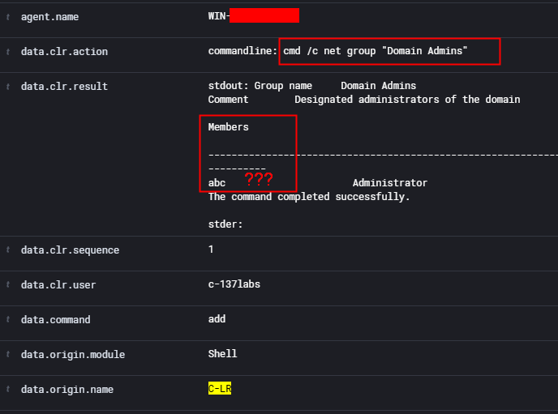
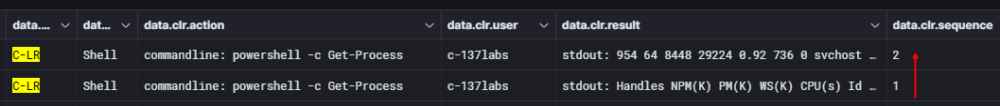

During a threat hunting process, reviewing telemetry alone is not always enough. To fully understand what's happening on a potentially compromised host, you also need to interrogate the system directly. [C-LR Shell](https://github.com/lr2t9iz/C-LiveResponse/blob/main/docs/endpoint/shell.md), a submodule of C-LiveResponse, enable responders to send live commands to an endpoint and gather real-time evidence using Wazuh's Active Response combined with CMD or PowerShell commands.

This guide will show how to use C-LR Shell via the Wazuh API and DevTools.

## How C-LR Shell Works?
By leveraging **cmd /c** or **powershell -c**, hunters can run commands like `netstat -ano` to inspect live network connections, `tasklist` to identify suspicious processes, or `Get-ScheduledTask` to check for persistence mechanisms.

The command output is returned as a structured event and can be reviewed in the `Explore > Discover` section of the Wazuh dashboard providing immediate, live telemetry to support your hunting hypotheses.

> For now, it is only available for Windows endpoints.
{: .prompt-info }

## Usage
- <https://github.com/lr2t9iz/C-LiveResponse/blob/main/docs/endpoint/shell.md> <br><br>

- Copy the [shell.exe](https://github.com/lr2t9iz/wazuh-live-response/tree/main/endpoint/windows/bin) executable to the Active Response folder on the Windows agent `C:\Program Files (x86)\ossec-agent\active-response\bin\`
- We can deploy a [lab environment](https://c-137labs.mitzep.com/posts/wazuh-s1em/) by following these instructions to conduct testing.

### Live Response in Action
- ≡ > Server management > Dev Tools > Console
- Change the agent ID and the arguments command accordingly.
```json
PUT /active-response?agents_list=001
{
  "command": "!shell.exe",
  "arguments": ["cmd /c net group \"Domain Admins\""],
  "alert": {
    "data": {
      "user": "c-137labs",
      "debug": false
    }
  }
}
```
- After executing the command, you can view its output in Wazuh `Explore > Discover` by applying the filter: `data.origin.name:"C-LR"`. This allows you to inspect the command result, execution time, and the endpoint where it was run.
- ≡ > Explorer > Discover
 <br>

For commands with large outputs such as `Get-Process`, the response is split into blocks. Each block includes a sequence field that helps you reconstruct and order the full output correctly.

```json
PUT /active-response?agents_list=001
{
  "command": "!shell.exe",
  "arguments": ["powershell -c Get-Process"],
  "alert": {
    "data": {
      "user": "c-137labs",
      "debug": false
    }
  }
}
```
<br><br>

If a suspicious process is identified during hunting such as one revealed by `tasklist` or `Get-Process`, you can take action immediately by sending a `taskkill` command through C-LR Shell. This capability allows threat hunters to not only observe, but also respond in real time to reduce risk and contain potential threats.

For more details, visit the official [C-LR Shell Docs](https://github.com/lr2t9iz/C-LiveResponse/blob/main/docs/endpoint/shell.md) <br><br>

With great power comes great responsibility. Use live response actions carefully. 
Happy Hunting!!!